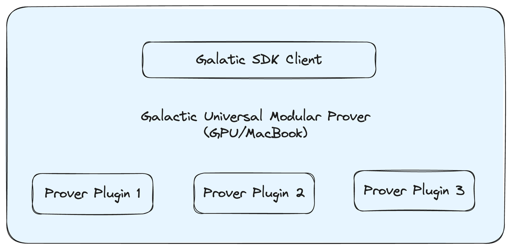

# Graph-Based Computation Tasks Scheduling
## ZKP Proving Task Description

In AI, like TensorFlow, we will use graphs to describe the computation. In the graph, there are many operations, such as conv, pooling, and so on. 

In ZKP, we also have similar requirements, because:

1. For ZKVM, the continuation technology will split the big proving tasks into smaller ones. 
2. The recursion/composition/aggregation technology is widely used.

*Proof Composition (Source: Figment Capital)*

For each zkp proving task, we can define it as a kind of operation of a computation graph. Each device works as a computation node to finish the part of the proving tasks.

Thus, we can use a graph to describe the overall proving tasks. 

*Graph-Based Computation*

For each operation, we can define these properties:

- input operation (null, one input or multiple inputs)
- name: (support customization)
    - “zkp-singleton"
    - “zkp-continuation”
    - “zkp-recursion-A”
    - “zkp-recursion-B”
    - “zkp-aggregation”
    - ……
- device requirements
    - OS type
    - CPU requirements
    - GPU requirements
    - Memory requirements
- devices id (null when it’s not assigned)
- output operation

## Power of Computation

The platform's incentives are determined by the Power of Computation. Without an accurate measurement of computation power, we can't effectively incentivize devices.

For Zero-Knowledge Proof (ZKP) algorithms, most computations are operations such as Multi-Scalar Multiplication (MSM), Number Theoretic Transform (NTT), and Hash, which are similar to operations in Artificial Intelligence (AI) like encoders, decoders, or Convolutional Neural Networks (CNN).

We can create a table defining the computation amount for each operation based on the add/multiply function and its bitwidth. This is referred to as the 'Gas' of the ZKP/AI. An offline benchmark tool can then be used to calculate the total Gas for an algorithm.

This method won't be 100% accurate, so our final computation can be measured using a formula like:

$P = P_{gas} * Gas$

Here, $P$ represents the total computation amount for an algorithm, and $P_{gas}$ is a dynamic price that can be retrieved from the Galactic network to reflect the supply and demand relationship.

## Galactic Universal Modular Prover

The UMP means each ZKP accelerator can support different kinds of ZKP proving tasks.

*Universal Modular Prover*

The Oracle node features a plug-in service. This allows provers to connect and determine the types of tasks the prover can manage. The corresponding proving binary Docker is then downloaded, enabling the node to handle such tasks.

In this manner, a single accelerator can support multiple ZKP proving binaries.

The Galactic SDK client connects to the proving binary plugin via RPC call.

The protocol includes:

1. Init 
2. Start
3. Stop

There is a mechanism to trigger different kinds of computation. 

- high-efficient mode (default mode): The computation service is restarted each time.  It can easily switch among different tasks.
- high-performance mode: The computation service stays in the memory, and when a new task comes, it doesn’t need to restart the service. It’s used for high throughput tasks.

Each kind of requester project can define its expected mode.

## Scheduler

We will use Oracle Node to take the role of scheduling.

Oracle node will receive the status of all the connected provers and record its liveness and busy/idle status. Once a new task is published, the scheduler will start to work.

Here, we define a task-node matching mechanism.

Firstly, after analyzing a computation graph, a 

- Descriptor of tasks (optimized binary related)
    - Graph
    - Task mode:
        - Performance priority: Redundancy of provers
        - Cost priority: Only one prover for each operation.
- Descriptor of device
    - OS type
    - CPU type
    - GPU type
    - Memory

Then we we find a candidate device list for each operation. 

Here we can adopt a relatively simple and effective strategy rather than a complex reputation system.

1. The proposed rules include:
- If a prover fails to generate proof in time, a filter window will be used to exclude this prover.
- If the prover fails to generate proof for the second time, the length of the prohibition window will be doubled.
- If there are more than 3 consecutive failures, then the prover will be permanently banned. The only way to regain access is to rename the prover and reconnect to the scheduler.
2. The scheduler in the Oracle node can reschedule the prover if they fail to generate proof in time. 
3. For tasks with high penalty amounts, the scheduler could assign more than one prover.

When we need more than one device, and then we will exclude the assigned device and use the above method to choose the other devices.

Finally, we will fill in the device ID for each operation of the computation graph.