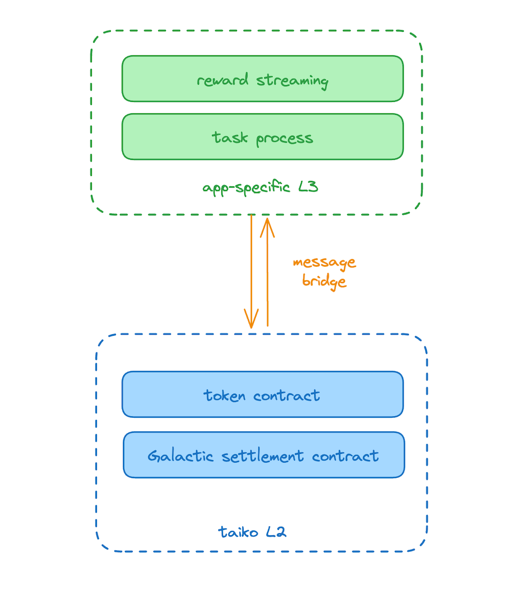
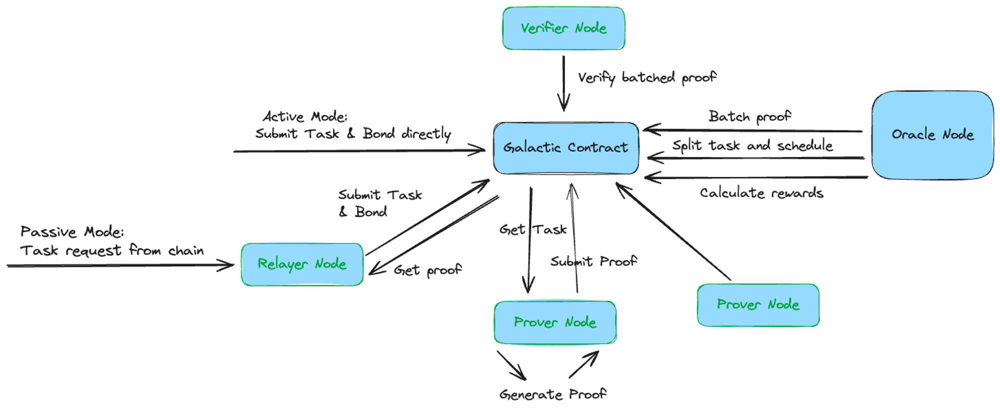

# Modular Galactic Network Overview
## Ethereum L3-Based Appchain

We expect the network to have high-performance requirements due to the frequent chain interactions and token transactions associated with the lifecycle of proof tasks. As such, cost is a significant consideration.

To reduce the overall cost, we will deploy our protocol layer on an Ethereum L3 Appchain which is L2 of another L2 rollup, which offers the following advantages:

1. Compatibility with the Ethereum ecosystem
2. Low transaction fees, essential for the numerous interactions with smart contracts
3. Customizable block proposing speed, for instance, every 1 second, and block finalization frequency, like every 1 minute, to further reduce cost
4. Its own ecosystem including bridge, DEX, etc. which could potentially expand in the future
5. Decentralization

We will start with the Taiko chain, and consider other chains as a backup.

Taiko allows for setting the ratio between optimistic proofs (no ZK computation) and ZK proofs (requires ZK computation) of blocks, significantly reducing the cost. We will also batch  blocks to decrease the transaction fee of settling block data into L2. Furthermore, we will consider using a Data Availability Layer to lessen the cost of writing data to L2.

However, we will not compromise on security. The protocol's main contract and token contract will be deployed on Taiko L2, which are used to settle the protocol's vault and reward pool. Using Taiko's built-in cross-chain messaging infrastructure, we can seamlessly settle funds from Galactic network’s protocol layer to L2. Storing funds on L2 is safer as it is more decentralized compared to our protocol layer, which is more application-specific.

On our protocol layer, we will deploy frequently operated contract logic, such as the circulation of proof fees, streaming payment, and the lifecycle of proving tasks. This will help maintain a low overall cost, allowing network users to focus on their tasks, not the cost of network transactions.

  
 *Ethereum L3-Based Appchain*

L2 is an extension of Ethereum's performance, while L3 is an extension of L2's performance. We estimate that app-specific L3 can have a gas limit of 0.5-1B, which is equivalent to each block containing 1000 ERC20 transfers. And it can achieve sub-second block speed. In summary, it can reach 1000-5000 tps or higher.

The main transaction cost of L3 is the block data storage written to L2. On average, each L3 transaction consumes 2000-3000 L2 gas. If it reaches 1000 tps, it will consume 0.002 ETH at an L2 gas price of 1 gwei. So if L2 is used as the data availability layer, the cost will be high. Our choice is to use other dedicated data availability layers, such as Celestia, EigenDA or Avail. Based on the [calculations](https://medium.com/@numia.data/the-impact-of-celestias-modular-da-layer-on-ethereum-l2s-a-first-look-8321bd41ff25) provided, costs will decrease by approximately 300 to 500 times, making them essentially trivial.

## Galactic Network Modules

The Galactic contract will act as the central hub for essential network records, including projects, provers, tasks, rewards, bonds, and staking, among others. This will be the foundation for the entire decentralized network.

The Oracle node, a component of the network, will handle complex task scheduling, reward distribution, and proof aggregation.

Prover, relayer, and verifier nodes can all function in a decentralized manner externally, using the Galactic contract as their source of truth.

 
 *Galactic Network Modules*

### What does the Galactic Contract contain?

 
 *Galactic Contracts*

1. Task events for actions: submission, proof, and verification.
2. Projects, provers, verifiers and tasks.
3. Provers' rewards: these are updated periodically, for instance, daily.
4. The default reward calculation is conducted on-chain.
5. Provers' bonds.
6. Users' staking.

### What does the Oracle Node contain?

 
 *Galactic Oracle nodes*

1. Task scheduling: This is a complex logic. The final task scheduling results are written to the Galactic contract, while intermediate task statuses are stored in the local DB. Since task data are huge, which could potentially overload the contract, only the most necessary data are written to the chain.
2. Task split and aggregation: A task might be divided into multiple smaller subtasks and proved in parallel to increase efficiency.
3. Proof aggregation: generate a batched proof for a group of proofs
4. Complex reward calculation can be done off-chain if the default version in the Galactic contract cannot handle it or involves too many steps.

### What does the Relayer Node do?

A relayer node acts as an external node that integrates with ZKP projects. It does this by retrieving active tasks from the ZKP projects.

In the meanwhile, the relayer node needs to pay the gas fee and provide necessary ZKP projects’ staking toke if the corresponding projects require.

### What’s the task flow?
Here are a detailed modules relationship and a sequence diagram:

 *Galactic Network modules relationship*

*Galactic Network Flow Sequence*

The steps are like below:
1. The task request is directly submitted to the Galactic contract (Active mode).
    
    Alternatively, in Passive mode (as shown in the above diagram), the relayer retrieves the task from another chain and then submits the task, along with the bond, to the Galactic contract. The task should be described as a computation graph.
    
2. The Galactic contract publishes the proving task. The oracle node then retrieves task information from the contract, schedules the task based on the computation graph and the prover's attributes and availability, and sends the scheduled result to the contract.
3. The Galactic contract publishes the scheduled results, enabling each prover to determine whether they've been selected to join the task.
4. The prover node syncs the task from the Galactic contract, generates the proof, and sends it back to the Oracle contract.
5. An Oracle node monitors the Oracle contract. Plans are in place for an Oracle node to initiate an aggregation proof task, after which the verifiers will only need to verify the aggregated proof.
6. An Oracle node schedules the verifiers to perform the verification and notifies the Galactic contract.
7. The Galactic contract publishes the verifier task. The selected verifiers monitor this and begin verification.
8. The verifier returns the verification result to the contract. Once the Galactic contract determines that the majority of verification results pass, it marks the proof as verified.
9. The Galactic Oracle calculates the reward. (This logic may be transferred to the contract later.)
10. The Galactic contract returns the bond and shares the reward with the prover. Also the verifiers will get part of the reward.

In the architecture above there will be lots of interactions between other parties with the Galactic contract. This drives our choice of Ethereum L3 which will further reduce the transaction cost.