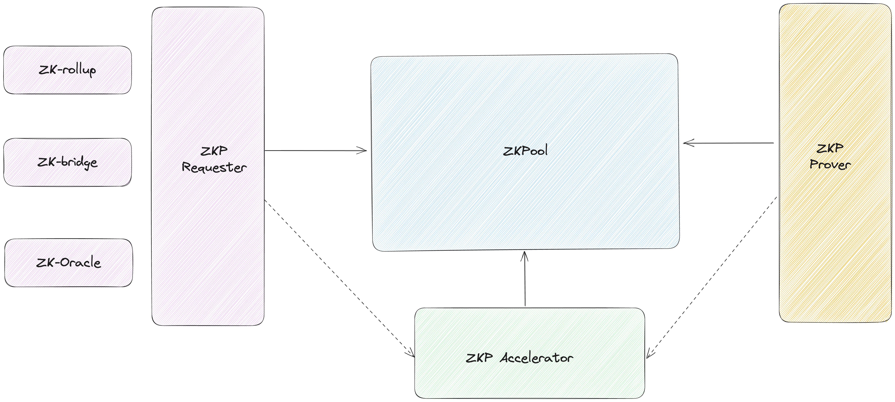
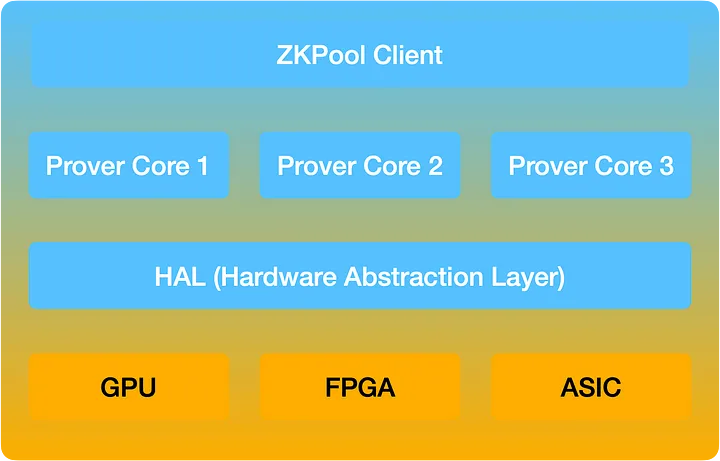

# Introduction

ZKPool is an open and permissionless platform that connects various ZKP projects and provers, offering multiple capabilities:

- ZKPool gathers the capacity of smaller provers and acts as a super prover proxy, providing necessary stake to ZKP projects.
- ZKPool adopts a strategy to maximize rewards and minimize the risks of being slashed.
- ZKPool distributes the rewards of provers among participants.
- ZKPool simplifies the process of joining for provers and ZKP projects.

# The Ecosystem of ZKPool
The participants in ZKPool include:
1. ZKP Requester: Refers to ZKP projects that require ZKP proofs.
2. ZKP Prover: Operators who own the hardware and run the provers.
3. ZKP Accelerator: A team that provides accelerated software implementation for certain ZKP projects.

The ZKP requester can also be a ZKP accelerator. For example, a ZKP project may have its own best GPU-accelerated software.

The ZKP prover can also be a ZKP accelerator. For example, ZKP prover operators may develop their own accelerated software.

The ecosystem is represented in the following diagram:

# Two-tier ZKP proving tokenomics
Currently, many ZKP projects use their own proving systems and tokenomics. To establish a healthier and more cost-effective ZKP proving ecosystem, a two-tier proving tokenomics model can be a viable solution. Taiko proposed a solution after several rounds of iteration of proving tokenomics. We have further extended this solution to a two-tier framework.

Under this approach, each ZKP project operates as tier 1, defining its own tokenomics. However, the selection, scheduling, penalty, reward, and rating of provers are delegated to tier 2, which is a shared prover pool.

The scope of the two tiers is as follows:
|  | Tier 1 (ZKP projects)  | Tier 2 (ZKPool) |
| --- | --- | --- |
| Scope | • Publish proof task.  • Establish rewards and penalties.  • Define key metrics such as proof window. | • Aggregate proof task.  • Schedule and rate prover resources.  • Distribute rewards.  • Assume penalty risk.  • Define price competition strategy |

# UMP (Universal Modular Prover)
ZKPool utilizes UMP (Universal Modular Prover) to integrate various provers.

A Universal Modular Prover can run on the same hardware platform while supporting the proving work of various ZKP projects.

